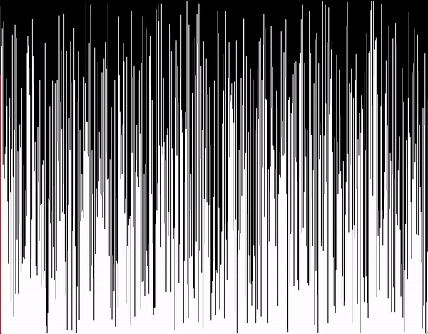
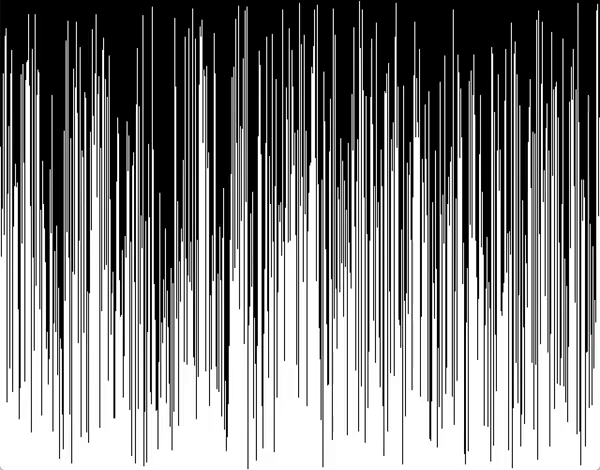
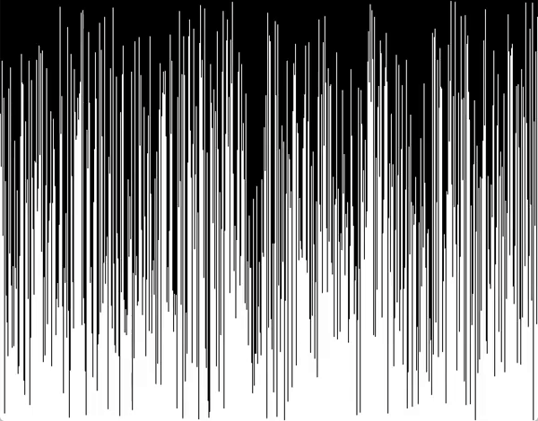
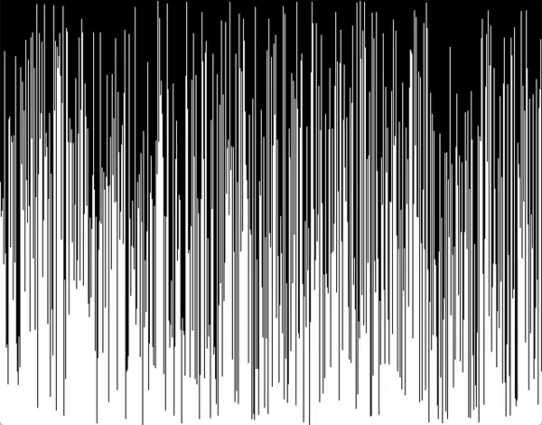
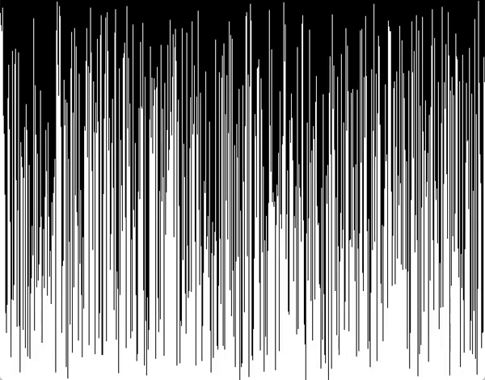

# Animated Sorting Algorithms
A collection of sorting algorithms animated in Processing.

This began as a way to solidify my understanding of QuickSort, but promptly turned into a small project I could make tangible progress in during short breaks in my schedule.

Below I've included GIFs of the animations I have created \(certain browsers may require users to click on the GIFs to start playing them\), and within you'll find the code used to accomplish this.

This was all done in Processing, a flexible software sketchbook and Java-based language for learning how to code within the context of the visual arts.

## Animations

For the best quality please run the code in Processing

### Selection Sort \(10x speed\)

### Insertion Sort \(9x speed\)

### Bubble Sort \(9x speed\)

### Cocktail Shaker Sort \(9x speed\)

### Merge Sort

### Quick Sort

### Radix Sort (LSD)

### Radix Sort (MSD)

